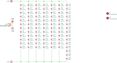

This section provides an overview of the schematic design for a single GrowBeam LED module.

---

## 📐 Schematic Overview

The full schematic is also available as an [PDF file](https://github.com/eiaro/growbeam/blob/main/hardware/exports/schematic.pdf).

---

## 🧾 Bill of Materials (BOM)

The full bill of materials is included as a CSV file:

📄 `hardware/exports/bom.csv`

This file lists all LEDs, resistors, and other components used in each module.

---

## 📏 Resistor Selection Rationale

Each LED string is limited by its own resistor. The values are chosen based on the number of LEDs in series and their forward voltages, using a basic Ohm's Law calculation:

$$
R = \frac{V_{\text{supply}} - V_{\text{LEDs}}}{I}
$$

Where:
- $ V_{\text{supply}} $ is the total supply voltage (24 V)
- $ V_{\text{LEDs}} $ is the combined forward voltage of the LED string
- $ I $ is the target current

| Resistor | LED Count | Estimated \( V_{\text{LEDs}} \) | Resistor Value | Target Drop | Expected Current |
|----------|-----------|-------------------------------|----------------|-------------|------------------|
| R1–R3    | 7 LEDs    | $ 2.75 \text{V} \times 7 = 19.25 \text{V} $ | 75 Ω         | ~4.5 V      | ~60 mA           |
| R4       | 8 LEDs    | $ 2.6 \text{V} \times 8 = 20.8 \text{V} $  | 51 Ω         | ~3.2 V      | ~63 mA           |

---

### 🔧 Power Rating

Each resistor needs to dissipate some power:

$$
P = V \times I
$$

For R1–R3:

$$
P \approx 4.5 \text{V} \times 0.06 \text{A} \approx 0.27 \text{W}
$$

For R4:

$$
P \approx 3.2 \text{V} \times 0.063 \text{A} \approx 0.2 \text{W}
$$

To ensure thermal margin and longevity, **0.5 W resistors** are recommended.

---

### ✅ Why Passive Current Limiting?

- No need for active LED drivers
- Easy to test with a multimeter
- Predictable and reliable
- Well-suited for low/medium power modules like GrowBeam

This approach keeps things simple, repairable, and cheap — without sacrificing stability or performance.
