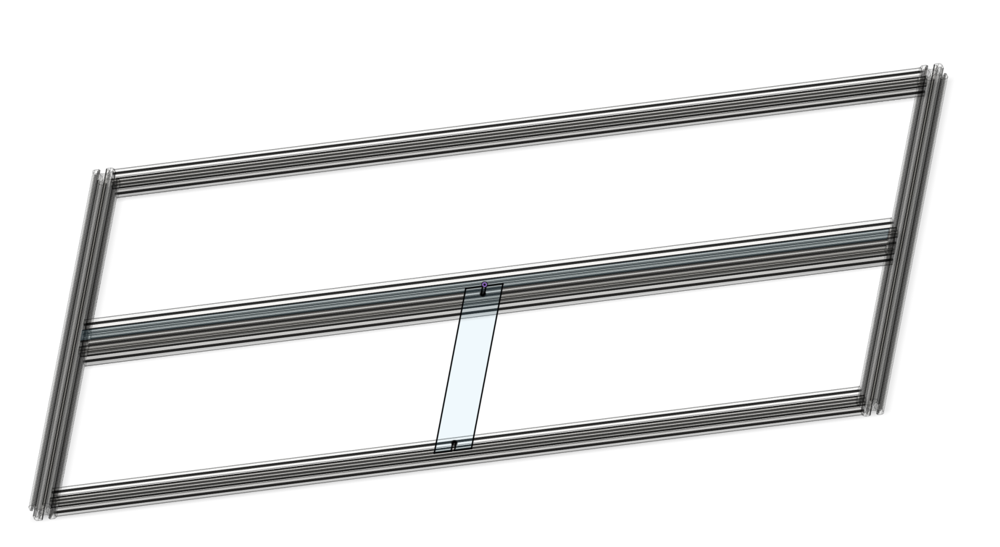

# 🏗️ Mechanical Design

Modules are mounted on a frame made from aluminum profiles.

## Frame Specification

- 2 vertical and 3 horizontal aluminum profiles
- Fits 5 × 5 modules with even spacing
- Center mounting plate for hanging or support

